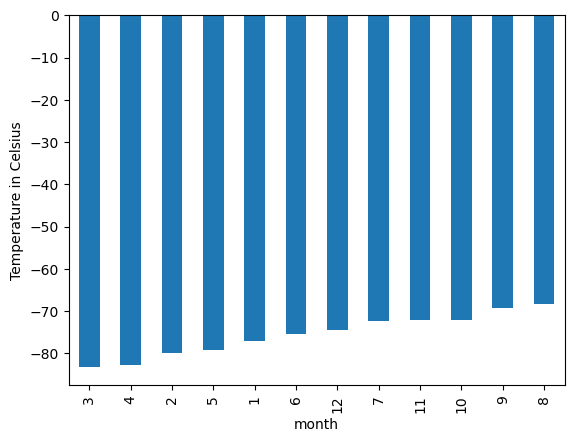
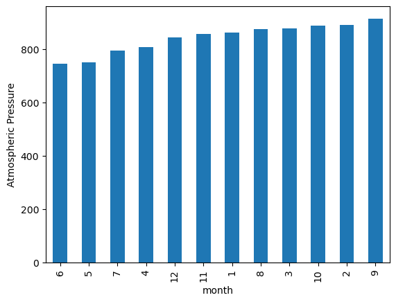
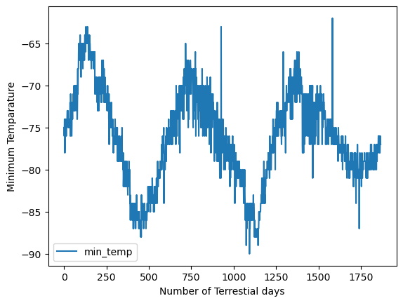

# mars_data_challenge

## Background
You’re now ready to take on a full web-scraping and data analysis project. You’ve learned to identify HTML elements on a page, identify their id and class attributes, and use this knowledge to extract information via both automated browsing with Splinter and HTML parsing with Beautiful Soup. You’ve also learned to scrape various types of information. These include HTML tables and recurring elements, like multiple news articles on a webpage.

As you work on this Challenge, remember that you’re strengthening the same core skills that you’ve been developing until now: collecting data, organizing and storing data, analyzing data, and then visually communicating your insights.

## What You're Creating
This new assignment consists of two technical products. You will submit the following deliverables:

Deliverable 1: Scrape titles and preview text from Mars news articles.

Deliverable 2: Scrape and analyze Mars weather data, which exists in a table.

### Instructions
# Part 1: Scrape Titles and Preview Text from Mars News
Open the Jupyter Notebook in the starter code folder named part_1_mars_news.ipynb. You will work in this code as you follow the steps below to scrape the Mars News website.

1-Use automated browsing to visit the Mars news siteLinks to an external site.. Inspect the page to identify which elements to scrape.
2-Create a Beautiful Soup object and use it to extract text elements from the website.
3-Extract the titles and preview text of the news articles that you scraped. Store the scraping results in Python data structures as follows:
    Store each title-and-preview pair in a Python dictionary and, give each dictionary two keys: title and preview. An example is the following:
    Print the list in your notebook.

        [{'title': "NASA's MAVEN Observes Martian Light Show Caused by Major Solar Storm",
         'preview': 'For the first time in its eight years orbiting Mars, NASA’s MAVEN mission witnessed two different types of ultraviolet aurorae simultaneously, the result of solar storms that began on Aug. 27.'},
         {'title': "NASA Prepares to Say 'Farewell' to InSight Spacecraft",
         'preview': 'A closer look at what goes into wrapping up the mission as the spacecraft’s power supply continues to dwindle.'},
         {'title': 'NASA and ESA Agree on Next Steps to Return Mars Samples to Earth',
          'preview': 'The agency’s Perseverance rover will establish the first sample depot on Mars.'},
         {'title': "NASA's InSight Lander Detects Stunning Meteoroid Impact on Mars",
        'preview': 'The agency’s lander felt the ground shake during the impact while cameras aboard the Mars Reconnaissance Orbiter spotted the yawning new crater from space.'},
        {'title': 'NASA To Host Briefing on InSight, Mars Reconnaissance Orbiter Findings',
        'preview': 'Scientists from two Mars missions will discuss how they combined images and data for a major finding on the Red Planet.'},
        {'title': 'Why NASA Is Trying To Crash Land on Mars',
        'preview': 'Like a car’s crumple zone, the experimental SHIELD lander is designed to absorb a hard impact.'},
        {'title': 'Curiosity Mars Rover Reaches Long-Awaited Salty Region',
        'preview': 'After years of climbing, the Mars rover has arrived at a special region believed to have formed as Mars’ climate was drying.'},
        {'title': 'Mars Mission Shields Up for Tests',
        'preview': 'Protecting Mars Sample Return spacecraft from micrometeorites requires high-caliber work.'},
        {'title': "NASA's InSight Waits Out Dust Storm",
        'preview': 'InSight’s team is taking steps to help the solar-powered lander continue operating for as long as possible.'},
        {'title': "NASA's InSight 'Hears' Its First Meteoroid Impacts on Mars",
        'preview': 'The Mars lander’s seismometer has picked up vibrations from four separate impacts in the past two years.'},
        {'title': "NASA's Perseverance Rover Investigates Geologically Rich Mars Terrain",
        'preview': 'The latest findings provide greater detail on a region of the Red Planet that has a watery past and is yielding promising samples for the NASA-ESA Mars Sample Return campaign.'},
        {'title': 'NASA to Host Briefing on Perseverance Mars Rover Mission Operations',
        'preview': 'Members of the mission will discuss the rover’s activities as it gathers samples in an ancient river delta.'},
        {'title': "NASA's Perseverance Makes New Discoveries in Mars' Jezero Crater",
        'preview': 'The rover found that Jezero Crater’s floor is made up of volcanic rocks that have interacted with water.'},
        {'title': "10 Years Since Landing, NASA's Curiosity Mars Rover Still Has Drive",
        'preview': 'Despite signs of wear, the intrepid spacecraft is about to start an exciting new chapter of its mission as it climbs a Martian mountain.'},
        {'title': "SAM's Top 5 Discoveries Aboard NASA's Curiosity Rover at Mars",
        'preview': '“Selfie” of the Curiosity rover with inset showing the SAM instrument prior to installation on the rover.'}]

# Part 2: Scrape and Analyze Mars Weather Data
Open the Jupyter Notebook in the starter code folder named part_2_mars_weather.ipynb. You will work in this code as you follow the steps below to scrape and analyze Mars weather data.

    1-Use automated browsing to visit the Mars Temperature Data SiteLinks to an external site.. Inspect the page to identify which elements to scrape. Note that the URL is https://static.bc-edx.com/data/web/mars_facts/temperature.html.
    2-Create a Beautiful Soup object and use it to scrape the data in the HTML table. Note that this can also be achieved by using the Pandas read_html function. However, use Beautiful Soup here to continue sharpening your web scraping skills.
    3-Assemble the scraped data into a Pandas DataFrame. The columns should have the same headings as the table on the website.
    4-Examine the data types that are currently associated with each column. If necessary, cast (or convert) the data to the appropriate datetime, int, or float data types.
    5-Analyze your dataset by using Pandas functions to answer the following questions:
    How many months exist on Mars?
    How many Martian (and not Earth) days worth of data exist in the scraped dataset?
    What are the coldest and the warmest months on Mars (at the location of Curiosity)? To answer this question:
    Find the average minimum daily temperature for all of the months.

        -On average, the third month has the coldest minimum temperature on Mars, and the eighth month is the warmest. But it is always very cold there in human terms!

Plot the results as a bar chart.

    Which months have the lowest and the highest atmospheric pressure on Mars? To answer this question:
    Find the average daily atmospheric pressure of all the months.
        -Atmospheric pressure is, on average, lowest in the sixth month and highest in the ninth.

Plot the results as a bar chart.

    About how many terrestrial (Earth) days exist in a Martian year? To answer this question:
    Consider how many days elapse on Earth in the time that Mars circles the Sun once.
        -The distance from peak to peak is roughly 1425-750, or 675 days. A year on Mars appears to be about 675 days from the plot. Internet search confirms that a Mars year is equivalent to 687 earth days.

Visually estimate the result by plotting the daily minimum temperature.

Export the DataFrame to a CSV file.

    -file is under the name mars_facts.csv